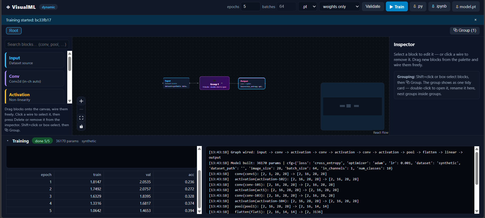
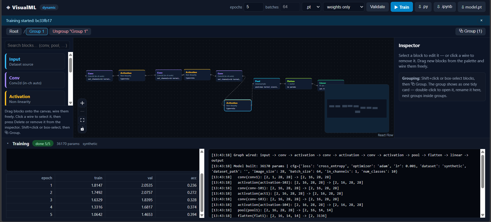

# VisualML — Build Neural Networks Visually

A modular, visual workbench for creating neural networks: drag blocks (Input, Conv,
Activation, Pool, Flatten, Linear, Dropout, Output) onto a canvas, wire them together,
configure them in an inspector, press **Train**, and watch live loss curves stream back.
Save the result (`.pt` / `.pth` / `.pkl`, weights-only or full checkpoint), export the
whole architecture as a clean standalone `.py` / `.ipynb` file, or save the canvas itself
as a `visualML v1 JSON` graph (`visualml-graph.json`) — which can be re-imported later or
produced by an AI assistant from the in-app format guide. PyTorch is the compute
engine, React is the view.

```
visualML/
├── engine/   # FastAPI + PyTorch backend  (port 8000)
│   ├── graph.py         # schema + staged validation (ValidationError, validate_dynamic, check_semantic_ranks)
│   ├── model_builder.py # GraphExecutor, build_model, validate_pipeline, count_params
│   ├── main.py          # REST + WebSocket endpoints
│   ├── datasets.py      # resolve_num_classes + loaders (synthetic/mnist/imagefolder)
│   ├── trainer.py       # background jobs + WS fan-out
│   ├── exporter.py      # standalone .py / .ipynb export
│   └── requirements.txt # fastapi, uvicorn, torch, numpy, pillow, pydantic, python-multipart
├── view/     # React + Vite + React Flow frontend (port 5173)
│   └── src/
│       ├── App.tsx                 # studio shell, scope/groups, validate/train/export, guide modal
│       ├── graph.ts                # PALETTE, KIND_META, defaultParams, FIELDS, validate/job types
│       ├── api.ts                  # serialize, postJSON, download helpers
│       └── components/             # ConfigPanel, LogsPanel, MlNode, GroupNode
├── tests/    # pytest suite (30 tests: pipeline stages, JSON round-trip, export regression)
└── previews/ # home.png, grouped.png
```

---

## 1) Overall idea

### What this project does

VisualML turns neural-network construction into a **LEGO-like visual activity**. Instead of
writing PyTorch boilerplate, the user:

1. **Drags blocks** from a searchable palette onto a canvas (unlimited instances of any block).
2. **Wires them** with edges that represent tensor flow, in any DAG shape — chains, branches,
   skip connections.
3. **Configures** each block in an inspector (channels, kernels, activations, batch size,
   dataset path, learning rate, …).
4. **Groups** blocks into named, collapsible sub-assemblies (e.g. “Encoder”, “Classifier head”)
   that appear as one tidy card at the root but can be double-clicked open — including nested
   groups — so large architectures stay readable.
5. **Validates instantly**: the engine runs a six-stage pipeline
   (schema → structural → semantic → params → trace → dataset) and either reports the
   topological order, per-block shapes and parameter counts, or a structured error naming the
   exact block, what was expected, what was found, why, and how to fix it.
6. **Trains in the UI**: sets epochs, picks save format (`.pt` / `.pth` / `.pkl`) and save mode
   (weights-only vs full training state), presses **▶ Train**, and watches per-epoch
   train/val loss, accuracy, and log lines stream in live over WebSocket.
7. **Takes the model with them**: downloads the trained file, or exports the architecture as a
   clean, runnable `model.py` / `model.ipynb` with all dimensions resolved to concrete numbers.
8. **Saves and reuses graphs as JSON**: exports the full canvas (blocks, positions, groups,
   wires) to `visualml-graph.json` and re-imports it later — see §2.14.
9. **Builds graphs with AI help**: presses the **i** guide button, copies the format guide
   (+ per-block init snippets from the Available Nodes tab), asks any LLM for a graph, and
   imports the returned JSON — see §2.15.

### What it is trying to solve

- **Barrier to entry.** Building even a small CNN in PyTorch requires knowing datasets,
  dataloaders, shape bookkeeping (`in_features` after every flatten), training loops,
  checkpointing, and device handling. VisualML absorbs all of that: conv/linear layers
  **infer their input sizes automatically** from whatever flows into them, so users think in
  _blocks and data flow_, not tensor algebra.
- **Architecture comprehension.** Code hides structure; a graph _shows_ it. Grouping adds
  zoom levels (root overview → named sub-assembly → raw blocks), which is how engineers
  actually reason about big models.
- **Iteration speed.** Change a kernel size, rewire a branch, retrain, compare loss curves —
  without touching code. Validation errors name the exact block and problem
  (e.g. `Linear block 'fc1' expects 2D [B,F] but got 4D [B,C,H,W] — add a Flatten block
  before Linear`), and the canvas jumps to and selects the offending block, even inside a
  collapsed group.
- **No lock-in.** Everything the UI knows can leave the UI: the trained weights _and_ a
  human-readable, dependency-light source export that runs anywhere PyTorch runs.

### Current scope (working prototype)

Image classification with a dynamic CNN/MLP DAG (the original “LLM” framing is the north
star; the engine abstraction — typed blocks + DAG executor — is what a transformer-block
extension would plug into). Single input, single output, CPU training, `cross_entropy`
loss, `adam`/`sgd`.

---

## 2) Architecture

### 2.1 Tech stack

| Layer    | Technology                                       | Role                                                    |
| -------- | ------------------------------------------------ | ------------------------------------------------------- |
| Engine   | **Python 3.10, PyTorch ≥ 2.0, FastAPI, Uvicorn** | Model building, datasets, training, export, persistence |
| View     | **React 19, TypeScript, Vite, React Flow v11**   | Drag-drop canvas, inspector, training dashboard         |
| Protocol | **REST (JSON) + WebSocket**                      | REST for control plane, WS for live training telemetry  |
| Storage  | Filesystem (`engine/runs/`, `engine/data/`)      | Job checkpoints, cached MNIST, uploaded datasets        |
| Tests    | **pytest + torch** (`tests/`, 30 tests)          | Pipeline stages, JSON round-trip, export regression     |

No database, no auth, no GPU requirement, no `torchvision` dependency (image decoding is
done with Pillow + NumPy so the install stays lean).

### 2.2 Methodology — how a graph becomes a trained model

**a) The view sends a flat graph.** Group proxies are stripped client-side
(`view/src/api.ts::serialize`), so the engine always sees blocks + wires:

```json
{
  "nodes": [
    {
      "id": "conv1",
      "type": "conv",
      "params": {
        "out_channels": 16,
        "kernel_size": 3,
        "stride": 1,
        "padding": 1
      }
    }
  ],
  "edges": [{ "id": "e2", "source": "conv1", "target": "act1" }]
}
```

**b) One staged pipeline validates everything** (`engine/model_builder.py::validate_pipeline`,
shared verbatim by `POST /api/validate`, `POST /api/train`, and the training worker):
schema → structural → semantic → params → trace → dataset. Full detail in §2.3; every
failure is a `ValidationError` carrying `{stage, node_id, op, expected, got, reason, hint}`.

**c) Lazy shape inference builds the model** (`engine/model_builder.py::GraphExecutor`).
Conv and Linear layers are created _during a dry-run trace_ with a dummy batch
`(2, in_channels, image_size, image_size)`, reading the actual incoming tensor shape — so
users never declare `in_channels`/`in_features`. Execution is topological; a block with
several incoming wires merges by element-wise sum (shape mismatches fail with an explicit
message). A final check enforces `output_features == num_classes` and tells the user how
to fix it. The trace also records per-block `in → out` shapes plus per-block `num_params`,
which power the Validate response and the code exporter.

**d) Class count is resolved before building** (`engine/datasets.py::resolve_num_classes`):
`mnist` → 10; `imagefolder` → number of class subfolders; `synthetic` → `out_features` of
the last Linear block (the architecture defines its own demo problem). See §2.5.

**e) Data loading** (`engine/datasets.py`). `synthetic` (zero setup), `mnist` (cached IDX),
`imagefolder` (zip-uploadable class folders). See §2.5.

**f) Training as a background job with WS fan-out** (`engine/trainer.py`). See §2.6.

**g) Export resolves everything to concrete numbers** (`engine/exporter.py`). See §2.7.

**h) Groups are view-only.** Grouping sets `parentId` membership on the master node list;
edges are _never rewritten_. The current scope renders direct children; wires crossing a
collapsed group render as computed dashed “portal” stubs. Train/Validate/Export serialize
the untouched master graph, so grouping cannot corrupt an architecture. Wiring _onto_ a
collapsed card auto-resolves when the group has a single entry/exit block, otherwise the UI
asks you to open the group and wire the exact block. See §2.8.

**i) The canvas itself persists as visualML v1 JSON** (flat React Flow state, distinct
from the slimmed-down engine graph in (a)). See §2.14.

### 2.3 Validation pipeline (the heart of the app)

`validate_pipeline(raw_nodes, raw_edges)` in `engine/model_builder.py` runs six stages in
order and returns `{model, cfg, specs, warnings, order, num_classes, total_params}`.
`specs` holds one entry per compute block with `{id, kind, params, num_params, in, out}`.
`total_params` comes from `count_params` (sum of `numel` over all parameters). The same
function backs Validate, Train (fail-fast, before any job is created), and the training
worker — so a graph that validates will build identically everywhere.

All failures raise `engine/graph.py::ValidationError`, a `ValueError` subclass whose
`str()` is the plain human message (backward compatible with `HTTPException(400, str(e))`
and old `j.detail` clients) plus structured fields via `to_dict()`:
`{stage, node_id, op, expected, got, reason, hint, message}`. Over HTTP the error envelope
keeps `detail` as the plain string and adds the structured fields both top-level and under
`error` (`engine/main.py`), so old clients display the message while new clients can
highlight the exact block.

#### Stage 1 — schema (`engine/graph.py::validate_dynamic`, first half)

- Graph must be non-empty.
- Block ids must be unique (duplicates rejected).
- Exactly one `input` and exactly one `output` (counts of 0 or 2+ rejected).
- Every block type must be known (`input | conv | activation | pool | flatten | linear |
  dropout | output`, after legacy aliasing). There is deliberately no such allowlist on
  _import_ — unknown kinds load onto the canvas, but validation rejects them with the
  available list.
- Legacy PoC names still work: `cnn` → `conv`; a legacy `classifier` block is expanded
  into `adaptive-pool → flatten → [linear → relu] → linear` (honouring `hidden_dim`),
  mirroring the original fixed head.

#### Stage 2 — structural (`validate_dynamic`, second half)

- Duplicate wires rejected (`source → target` may appear at most once).
- Edge endpoints must reference known nodes, no self-loops, no cycles — all detected by
  reusing `order_graph` (Kahn's topological sort); cycle/self-loop/unknown-ref messages are
  wrapped as structural errors with a fix hint.
- Every block must lie on the input → output data path (forward reachability from input
  plus backward reachability to output); orphans are reported by `type(id)`, e.g.
  `conv(orphan)`.
- `output` needs an incoming wire; `input` needs an outgoing wire.

#### Stage 3 — semantic ranks (`engine/graph.py::check_semantic_ranks`, no torch)

A static rank is propagated in topological order. Mixed/unknown branch ranks are left
unresolved here and deferred to the trace-stage merge check.

| Block                | Rank rule                                   |
| -------------------- | ------------------------------------------- |
| `input`              | 4D source                                   |
| `conv`               | 4D → 4D                                     |
| `pool`               | 4D → 4D                                     |
| `flatten`            | 4D → 2D                                     |
| `linear`             | 2D → 2D                                     |
| `activation`/`dropout` | passthrough (any rank in, same rank out)  |
| `output`             | must receive 2D logits                      |

The flatten boundary is one-way: once data is 2D it may never flow back into a 4D block.
`conv → conv` is always valid and never a warning or error. Exact rejects:

- `Linear block 'fc' expects 2D [B,F] but got 4D [B,C,H,W] (incoming from input/conv) —
  add a Flatten block before Linear` (covers `input → linear` and `conv → linear`;
  hint names the exact predecessor, e.g. `Add Flatten between conv1 and 'fc'`).
- `Conv/Pool block 'x' expects 4D [B,C,H,W] but got 2D [B,F] — flatten boundary: once
  flattened, data cannot flow back …` (covers `flatten → conv/pool` and `linear → conv/pool`;
  hint suggests moving the block before Flatten or dropping the Flatten).
- `Output block 'out' expects 2D logits [B, classes] but got 4D [B,C,H,W] — add Flatten +
  Linear(out_features=<classes>) before output` (a graph that never flattens to logits).

#### Stage 4 — params (same loop as Stage 3, no silent clamps)

Missing params fall back to defaults; present-but-invalid values are hard errors naming
`{stage: "params", node_id, op}`. No value is ever clamped or coerced silently.

| Block | Rules |
| ----- | ----- |
| `input` | `image_size > 0`, `batch_size > 0`, `in_channels > 0` (integers) |
| `conv` | `out_channels > 0`, `kernel_size`/`kernel > 0`, `stride > 0`, `padding >= 0` |
| `pool` | kind must be `max \| avg \| adaptive` (read from `pool`, falling back to `type`); `adaptive` requires `adaptive_size > 0`, otherwise `kernel_size`/`kernel > 0` and `stride > 0` (defaults to kernel) |
| `linear` | `out_features > 0` |
| `dropout` | `0.0 <= p < 1.0` (`p = 1` and negatives rejected; `p = 0` is a warning, not an error) |
| `activation` | type must be one of `relu, sigmoid, tanh, leaky_relu, gelu, softmax` (the inspector dropdown in `view/src/graph.ts` offers all but `softmax`; the engine accepts `softmax` and warns about logits — see warnings) |
| `output` | `loss` must be `cross_entropy` (or its `ce` alias); `optimizer` must be `adam \| sgd`; `lr` must be a number `> 0` |

#### Stage 5 — trace (`GraphExecutor.forward` dry run + post-trace checks)

Only reached with a rank- and param-clean graph, so it reports genuinely dynamic problems:

- Branch merge: a block joining N branches sums them element-wise, which requires
  **identical shapes** — mismatches fail naming the block, the branch count, and every
  branch shape, with a hint to align branches (Linear/Pool/Flatten).
- Per-block execution is wrapped: any torch failure (e.g. pooling a feature map that has
  already collapsed to zero spatial extent after too many downsamples) is re-raised as a
  trace error with the block id, op, and the exact input shape (`… failed on input shape
  […]`).
- Output must be 2D logits — no softmax is ever applied by the engine (`CrossEntropyLoss`
  applies it); a non-2D final tensor fails with the received shape.
- **Final-classifier rule:** `final.shape[1]` must equal the resolved class count, else
  `Architecture outputs A features but the dataset has N classes (Expected N, Actual A)`
  with `reason: "final Linear out_features != dataset class count"`, `node_id` of the last
  Linear block (or output if there is none), and a hint to set the last Linear's
  `out_features` to N.

#### Stage 6 — dataset (`resolve_num_classes` failures surface here)

Bad dataset configuration (e.g. `imagefolder` with a missing path or no class subfolders)
fails as `stage: "dataset"` pointing at the input block.

#### Warnings (never block; returned on `ok: true`)

| Code | When |
| ---- | ---- |
| `flatten_flatten` | a Flatten directly follows another Flatten (redundant, safe to delete) |
| `act_act` | an activation directly follows another activation (usually redundant) |
| `dropout_zero` | `dropout` with `p = 0` (no-op, safe to delete) |
| `resolution_1x1` | a conv/pool block outputs 1×1 spatial resolution (further conv/pool can't learn spatial features) |
| `softmax_logits` | a `softmax` activation exists anywhere (CrossEntropyLoss expects raw logits) |

### 2.4 Block reference (every param, defaults, inferred dims)

Inspector defaults and field widgets live in `view/src/graph.ts` (`defaultParams`, `FIELDS`).
`in_channels` (conv) and `in_features` (linear) never appear anywhere — they are always
inferred by the trace.

| Block | Params (default) |  Inspector widget | Inferred dims |
| ----- | ---------------- | ----------------- | ------------- |
| `input` | `dataset: synthetic \| mnist \| imagefolder` (`synthetic`), `dataset_path` (text, `""`), `image_size` (`28`), `batch_size` (`64`), `in_channels` (`1`, dropdown `1/3`) | select/text/number | emits `[B, C, H, W]` from `in_channels × image_size²` |
| `conv` | `out_channels` (`16`), `kernel_size` (`3`, also accepts legacy `kernel`), `stride` (`1`), `padding` (`1`) | numbers | in-channels inferred; emits `[B, out_channels, H', W']` |
| `activation` | `type` (`relu`; select `relu/sigmoid/tanh/leaky_relu/gelu`) | select | passthrough shape |
| `pool` | `pool` (`max`; select `max/avg/adaptive`), `kernel_size` (`2`, accepts `kernel`), `stride` (`2`, defaults to kernel), `adaptive_size` (`4`, adaptive only) | select + numbers | 4D → downsampled 4D |
| `flatten` | none (`No parameters — just wire it in.`) | — | `[B, C, H, W]` → `[B, C·H·W]`; required before `linear` on image tensors |
| `linear` | `out_features` (`64`; last one must equal class count) | number | in-features inferred; `[B, F]` → `[B, out_features]` |
| `dropout` | `p` (`0.5`, step `0.05`) | number | passthrough; active only in training mode |
| `output` | `loss` (`cross_entropy`, select-only), `optimizer` (`adam`; select `adam/sgd`), `lr` (`0.001`, step `0.0001`) | select/select/number | merges incoming branches; exactly one per graph |

`input` accepts an extra `dataset_path` via the inspector's zip-upload row (input blocks
only): uploading a `.zip` of class folders `POST`s to `/api/upload` and auto-fills
`dataset = imagefolder` + the returned server path.

### 2.5 Dataset compatibility

| Dataset | Class count | Loading | Notes |
| ------- | ----------- | ------- | ----- |
| `synthetic` | `out_features` of the last Linear (legacy `classifier`: its `num_classes`, default 10; errors if the graph has no Linear at all) | 2000 train / 500 val random images; labels from mean-pixel bins so loss visibly drops | Zero setup — the intended first-Train-click path |
| `mnist` | 10 | Raw IDX gz files downloaded once to `engine/data/mnist`, resized to `image_size` if ≠ 28 | Offline/download failure falls back to synthetic 2000/500 with the cause recorded in `dataset_info.source` |
| `imagefolder` | number of class subfolders under `dataset_path` | `<path>/<class>/*.png\|jpg\|jpeg\|bmp\|webp`, PIL-resized, grayscale iff `in_channels == 1`, 80/20 train/val split (≥ 1 val sample) | Missing path / no subfolders / no images are hard `dataset`-stage errors; `POST /api/upload` (multipart `.zip`, optional `target`) extracts to `engine/data/uploads/<name>` and returns `{path, uploads}`; `GET /api/uploads` lists them |

Loaders: train `batch_size` shuffled; validation `max(256, batch_size)` unshuffled.
`in_channels` defaults to 1 for `mnist`/`synthetic`, 3 otherwise.

### 2.6 Training

Top-bar controls: `epochs` (number input, 1–100, enforced again server-side), a read-only
`batches` display (batch size lives on the input block — hover tooltip says so),
`save_format` (`.pt/.pth/.pkl`) and `save_mode` (`weights_only` / `full`) dropdowns,
**Validate**, **▶ Train**, **⇩ .py**, **⇩ .ipynb**, model download link (appears after
training), **⇩ JSON**, **⇧ Import**, **i**.

- `POST /api/train` runs the full `validate_pipeline` **fail-fast** (same errors as
  Validate, no job created on failure), validates `save_format`/`save_mode`, then creates an
  8-hex job id via `trainer.py::create_job` and schedules `run_training` as an `asyncio`
  task. The heavy build runs in a worker thread (`asyncio.to_thread`).
- Each epoch: train pass (Adam/SGD, `CrossEntropyLoss`), then no-grad validation pass
  (`_evaluate`: mean loss + argmax accuracy). `history[]` appends
  `{epoch, train_loss, val_loss, val_acc}` (rounded to 4dp); `current_epoch` advances;
  timestamped lines accumulate in `logs[]`.
- Save to `engine/runs/{job_id}/model.{pt,pth,pkl}`: `weights_only` saves the raw
  `state_dict`; `full` saves `{checkpoint: {arch, train_cfg, graph, history, model_state,
  optimizer_state}}`. `.pkl` via `pickle`, `.pt`/`.pth` via `torch.save`. Unknown stored
  formats fall back to `pt`.
- `GET /api/jobs` / `GET /api/jobs/{id}` return summaries (`job_summary` strips the raw
  graph): `{job_id, status (queued/running/done/error), epochs, current_epoch, history,
  logs, save_format, save_mode, save_path, params, dataset_info, error}`.
  Failures set `status: error`, `error: "Type: message"`, plus a traceback-capped log line.
- `GET /api/download/{id}` serves the file (404 for unknown jobs or unfinished training).
- **WebSocket** `WS /ws/jobs/{id}`: unknown ids get `{type: error}` and a closed socket.
  Each subscriber owns a bounded queue (200, drops on full). Message types: `init` (full
  summary on connect, so late joiners see everything), `log` (one line), `progress`
  (`{epoch, epochs, train_loss, val_loss, val_acc}` or `{status: done/error, …}`),
  `ping` (summary keepalive every 20 s of silence), `final` (summary when done/error),
  `error`. The view closes any previous socket per Train click, replays state from `init`,
  appends logs (capped at the last 400 lines), merges per-epoch progress into the loss
  curve, and additionally fetches the job summary over REST.

### 2.7 Code export (`.py` / `.ipynb`, standalone)

`POST /api/export/python[?as_file=false]` and `POST /api/export/notebook` light-validate
(`validate_dynamic`) then run `engine/exporter.py`:

- Class count comes from `resolve_num_classes` (dataset-aware), and the graph is rebuilt +
  traced server-side so every lazy dim becomes a concrete number.
- **Pure chains** (every block has ≤ 1 predecessor) become a `VisualNet` with
  `nn.Sequential`; **branched DAGs** become a small explicit executor (`self.l_0…`,
  `vals[…]` dict, element-add merges) wired from the normalized edge list, so legacy
  `classifier` chains export correctly.
- The emitted file embeds config (`IMAGE_SIZE/IN_CHANNELS/NUM_CLASSES/BATCH_SIZE/EPOCHS/LR`),
  the model, `demo_data()`, a full training loop with the graph's optimizer, and
  `torch.save("model.pt")` — verified by tests to `compile`, import without running
  `main()`, and forward a `(2, C, H, W)` batch to `[2, classes]`. The notebook wraps the
  same code in `{nbformat: 4, nbformat_minor: 5}` with a markdown header cell + one code
  cell. Server copies land at `engine/runs/_export_model.py` / `.ipynb`.
- Export is architecture-only and one-way (positions/groups are not preserved) — unlike
  JSON persistence (§2.14), which is lossless.

### 2.8 Canvas operations (everything the mouse can do)

- **Palette** (left rail): all `PALETTE` kinds except `group`, each with its `KIND_META`
  color/label/description. The search box filters by kind id, label, or description
  (case-insensitive); an empty result shows an explicit empty state. Items drag via the
  `application/visualml` payload; the hint bar explains wiring, wire deletion, and grouping.
- **Drag-drop**: dropping creates `{kind}-{seq}` (counter starts at 100) with
  `defaultParams(kind)`, positioned relative to the canvas wrapper, auto-parented to the
  open group (`scope`), and immediately selected into the inspector.
- **Wiring**: drag from a right (source) handle to a left (target) handle, in any DAG shape
  — chains, branches (one block feeding many), skip connections, and merges (many feeding
  one). Connecting _onto_ a collapsed group card auto-resolves through its unique boundary
  block (`boundary()` in `App.tsx`: the single entry/exit); ambiguous groups post a notice
  naming the group and asking you to open it and wire the exact block. Self-connections are
  silently ignored; duplicate `source → target` wires are ignored (the engine would reject
  them as structural errors anyway).
- **Branch/skip + DAG merge rule**: one source may feed many targets freely; many sources
  may feed one target, but the engine merges by **element-add, which requires identical
  shapes** — align branches first (e.g. matching conv widths, or Linear/Pool/Flatten
  adapters), otherwise the trace stage reports every branch shape.
- **Delete**: `Delete` key removes the current selection (nodes and/or wires); the inspector
  offers per-block delete, per-wire delete buttons, and group dissolve/delete. Deleting a
  group cascades to nested members; any edge touching a deleted node is removed. Portal
  stubs map back to their real edge id before deletion.
- **Scope / breadcrumb**: double-click a group card to open it (breadcrumb `Root / A / B`
  gains a segment); click any crumb to jump up. The crumbs bar also offers `Ungroup
  "<name>"` for the open group and `⧉ Group (n)` for the current box/Shift selection.
  Grouping requires ≥ 1 selected block in the current view; the proxy card spawns above the
  selection centroid as `Group N` (`g-{seq}`) and the notice explains rename + double-click.
- **Groups, nested + portal stubs + auto-resolve**: membership is `parentId` on the master
  list (never stored on the rendered copy); `countMembers` counts nested blocks for the card
  subtitle. Each scope renders only direct children (`kidsOf`); an edge whose endpoints
  resolve to two different visible cards in this scope renders as a dashed stub
  (`portal:<realId>`, `strokeDasharray 6 4`); edges fully hidden inside one collapsed group
  render nothing. Wiring onto a collapsed card resolves via `boundary()` as described above.
  Ungrouping re-parents members to the dissolved group's own parent (dissolving the open
  group navigates up one level); nothing is ever rewired.

### 2.9 API endpoints (`engine/main.py`)

| Method | Path | Body / params | Returns |
| ------ | ---- | ------------- | ------- |
| GET | `/api/health` | — | `{ok, service}` |
| POST | `/api/validate` | `{nodes, edges}` | `{ok: true, order ("type(id) → …"), params (total), config, shapes ({id,kind,in,out,num_params}), warnings[]}` or 400 `{detail, stage, node_id, op, expected, got, reason, hint, error}` |
| POST | `/api/train` | `{graph, epochs 1–100, save_format pt\|pth\|pkl, save_mode weights_only\|full}` | `{job_id, …status}` (job runs in background; validation failures return the same 400 envelope as Validate, no job created) |
| GET | `/api/jobs` | — | All job summaries |
| GET | `/api/jobs/{id}` | — | Status, `current_epoch`, `history[]`, `logs[]`, `save_path`, `params`, `dataset_info`, `error` |
| WS | `/ws/jobs/{id}` | — | `init` → `log`/`progress` stream → `final`; `ping` keepalive replays state |
| GET | `/api/download/{id}` | — | The saved model file (404 until training finishes) |
| POST | `/api/export/python` | `{graph, epochs}`, `?as_file=false` for raw text | `model.py` download / code |
| POST | `/api/export/notebook` | `{graph, epochs}` | `model.ipynb` download (markdown + code cells) |
| POST | `/api/upload` | multipart `file` (.zip), optional `target` | `{path, uploads}` server-side dataset path |
| GET | `/api/uploads` | — | Previously uploaded dataset paths |

### 2.10 View internals (`view/src/`, per file)

- `App.tsx` — studio shell and all orchestration: master node/edge state, `scope`/`path`
  navigation, `kidsOf`/`directChild`/`countMembers`/`boundary` membership helpers,
  `viewNodes`/`viewEdges` derivation (`useMemo`; portal stubs computed, never stored),
  referentially-stable React Flow callbacks (`useCallback`/module constants — required
  because RF v11's `SelectionListener` re-fires on callback identity change and inline
  callbacks caused an infinite update loop/blank screen), `onDrop`/`onConnect`/
  `onNodesChange`/`onEdgesChange`, grouping (`groupSelected`/`ungroup`/`openGroup`/`goTo`),
  inspector edits (`patchParams`/`renameGroup`/`deleteNode`), backend calls
  (`validate`/`train`/`doExport`/`exportJson`/`onImportFile`), `revealNode` (select a node
  and jump scope to its immediate parent so collapsed groups reveal it), notices, and the
  `i` guide modal (`showGuide`/`guideTab`, `GUIDE_EXAMPLE`/`GUIDE_PROMPT`/`GUIDE_COPY`).
  RF's light-theme chrome (MiniMap, Controls) is force-overridden to dark in `App.css`.
- `graph.ts` — block kinds and shared types. `PALETTE` is the source of truth for available
  blocks (the guide's Available Nodes tab derives from it, so future blocks appear
  automatically); `KIND_META` (label/color/desc per kind); `canonKind` (legacy `cnn`→`conv`,
  `classifier`→`linear`); `defaultParams` per kind (`{}` for unknowns); `FIELDS` inspector
  specs (select options or numeric/text input with steps and hints — see §2.4 for the
  resulting per-block controls); `JobState`/`WireInfo`/`EpochPoint` types;
  `ValidateShape` (`{id, kind, in?, out?, nodeParams?, params?}`),
  `ValidateErrorInfo` (`{stage, node_id/nodeId, op, expected, got, reason, hint, message}`),
  `ValidateSuccess` (`{ok, order?, params?, config?, shapes?, warnings?}`);
  `fmtDims` (drops the traced batch dim, joins the rest with `x`);
  `nodeIdFromMessage` (regex fallback extracting a block id from legacy string errors —
  structured `error.node_id` always wins).
- `api.ts` — `API`/`WS` base URLs (`http://127.0.0.1:8000`, `ws://…`), `serialize()`
  (drops group proxies, maps to `{id, type: kind, params}` + `{id, source, target}`),
  `postJSON()` (throws `detail` on error while keeping the full structured body on
  `err.payload` for `validate()` to parse), `downloadBlob()` (POSTs to the engine and
  saves the response), `downloadText()` (saves client-side text — used for JSON export).
- `components/ConfigPanel.tsx` — inspector. Empty state (select-a-block guidance + grouping
  hint); group cards (free-text rename, member count, Open/Ungroup/Delete-group+contents);
  block cards (color-coded title, `FIELDS`-driven controls, per-field hints, Delete block);
  number inputs coerce empty strings to 0; unknown kinds render with no fields rather than
  crashing. `input` blocks additionally get a zip-upload row (`POST /api/upload` via
  `FormData`; success auto-sets `dataset=imagefolder` + `dataset_path`). Selected wires
  always render on top with per-wire delete buttons (plus a Delete-key tip).
- `components/LogsPanel.tsx` — collapsible training dock: header (status badge
  `status current/epochs`, param count, dataset source), SVG loss curve (train solid,
  val dashed, per-epoch dots), last-8 epoch table, Model Summary (order chain, total
  params, dataset, per-block `in → out` table via `fmtDims`, warnings list), and the live
  log pane.
- `components/MlNode.tsx` — canvas card: kind-colored title, one-line description, traced
  `in→out` shape label after validation, first-three-params summary (`k=v…`, else
  `no params`), target handle left / source handle right, selected highlight, and Linear
  fallback styling for unknown future kinds.
- `components/GroupNode.tsx` — collapsed-group card: folder glyph, editable name, member
  count, double-click-to-open hint, same handle layout.

### 2.11 Shape visibility, param counts, model summary

- After **Validate**, every card shows its traced `in→out` shape label (`fmtDims` drops the
  batch dim, e.g. `8x14x14→1568`), derived from the returned `shapes[]` in `viewNodes`.
- The LogsPanel Model Summary lists the topological order (`conv(in) → …`), total params
  (`count_params`), the resolved dataset, and a per-block table (`block | in → out |
  params`) plus any warnings (`⚠ …`).
- Per-block `num_params` travels in each shape entry (0 for parameter-free blocks).

### 2.12 UX: error → node highlight (including collapsed groups)

`validate()` in `App.tsx` handles both envelopes: the structured
`{error: {...}, warnings[]}` body (via `err.payload`) and legacy plain-text details (via
`nodeIdFromMessage` regex). It composes the notice as
`Invalid [node_id]: reason (stage op expected … got …) — hint`, preserves any accompanying
warnings into the summary, and calls `revealNode(node_id)`: the node is selected and the
scope jumps to its immediate parent chain, so an error inside a collapsed (even nested)
group opens the right level and highlights the card.

### 2.13 Groups recap (frontend-only concept)

The engine never sees groups (`serialize` drops them); the JSON format preserves them via
`parentId` (§2.14). Everything else is §2.8: nested membership, portal stubs, boundary
auto-resolve, cascade delete, dissolve-keeps-blocks.

### 2.14 Graph persistence — visualML v1 JSON (`App.tsx` + `api.ts`)

Top-bar buttons (left to right after the train controls): **Validate**, **▶ Train**,
**⇩ .py**, **⇩ .ipynb**, model download link (appears after training), **⇩ JSON**
(save canvas as `visualml-graph.json`), **⇧ Import** (load a v1 JSON graph),
**i** (format guide modal).

- **Envelope**: `{version: 1, app: "visualML", exportedAt: <ISO>, nodes: [...], edges:
  [...]}` where each node is `{id, type: "ml"|"group", position: {x, y}, parentId?,
  data: {kind, params, name?}}` (`kind` is an open-ended block-type string; `parentId`
  preserves group membership, so grouped canvases round-trip losslessly) and each edge is
  `{id, source, target}`. Engine-side round-trip tests additionally accept a
  `{version, app, graph: {nodes, edges}}` envelope and prove revalidation yields identical
  class counts and per-block shapes plus a passing forward (`tests/test_validate_stages.py`).
- **Import validation** (`parseGraphFile`): the file must parse as JSON with top-level
  `nodes`/`edges` arrays; every node needs a string `id`, a numeric
  `position: {x, y}`, and an object `data`; missing `type` coerces to `"ml"`;
  `type === "ml"` additionally requires a non-empty string `data.kind` (no PALETTE
  check); every edge needs string `id`/`source`/`target`. Success replaces the master
  nodes/edges, resets scope to root, posts a notice with counts
  (`Imported <file> (N nodes, M edges)`), and immediately revalidates the imported graph
  against the engine; failure posts `Import failed: <reason>` and the input value is
  always cleared so the same file can be retried. Failures never partially load.
- **Round-trip workflow**: arrange canvas → `⇩ JSON` → modify or close → `⇧ Import` →
  identical canvas (positions and group membership preserved, unlike `.py`/`.ipynb`
  export which is architecture-only and one-way).

### 2.15 Guide modal + AI workflow

- **Format tab** — the contract, unchanged since introduction: schema text (top-level
  `{version, app, exportedAt, nodes, edges}`; node/edge fields; `kind` is an open-ended
  block-type string with a `params` object; unknown kinds load as-is), a tiny
  input→linear→output example (`GUIDE_EXAMPLE`), a one-line prompt template
  (`GUIDE_PROMPT`: "Create a visualML v1 JSON graph … Only output JSON"), and a
  **Copy guide** button (copies `GUIDE_COPY` to clipboard). Clicking the overlay backdrop
  closes the modal (content clicks are stopped).
- **Available Nodes tab** — a catalog derived dynamically from `PALETTE` (no hardcoded
  kind list, so future blocks appear automatically). Per kind: the kind name, the
  one-line `KIND_META` description, and a minimal single-node init snippet
  `{"id":"<kind>-1","type":"ml","position":{"x":0,"y":0},"data":{"kind":"<kind>",
  "params":<defaultParams(kind)>}}`, rendered as a compact scrollable list of `<pre>`
  snippets. A **Copy all** button copies the whole catalog as text.
- **AI workflow**: `i` → copy guide (+ Copy all from Available Nodes) → paste into any
  LLM with a request ("Only output JSON") → save reply as `.json` → `⇧ Import` →
  auto-**Validate** runs against the engine (structured errors highlight the exact block
  to fix, §2.12).

### 2.16 Tests (`tests/test_validate_stages.py`, 30 tests)

No new deps beyond stdlib/pytest/torch, no new node types — the suite drives the engine
as-is (`validate_dynamic`, `check_semantic_ranks` via the pipeline, `ValidationError`,
`validate_pipeline`, `build_model`, `resolve_num_classes`, `generate_python`,
`generate_notebook`).

| # | Test(s) | What it proves |
| - | ------- | -------------- |
| 4 | `test_valid_simple_chain`, `test_valid_cnn_deep`, `test_valid_branched_merge_identical_shapes`, `test_valid_conv_conv` | Representative graphs (chain, deep CNN, branched merge, conv→conv) validate and forward `(2,1,28,28) → [2,10]` |
| 1 | `test_resolve_num_classes_reuse` | mnist→10, synthetic→last-Linear, `build_model` cfg agreement |
| 1 | `test_invalid_linear_before_flatten` | `input → linear` fails `semantic/fc` with a Flatten reason |
| 1 | `test_invalid_flatten_then_conv` | `flatten → conv` fails `semantic/conv` on the flatten boundary |
| 1 | `test_invalid_conv_then_linear_no_flatten` | `conv → linear` fails `semantic/fc` with a Flatten hint |
| 1 | `test_invalid_conv_flatten_conv` | `conv → flatten → conv` fails `semantic/c2` on the flatten boundary |
| 1 | `test_invalid_spatial_collapse` | 8 stacked pools fail `trace/p*` with `failed on input shape` |
| 1 | `test_invalid_wrong_final_linear_size` | 7-wide head on MNIST fails `trace/fc`, `reason` is the exact class-count mismatch |
| 1 | `test_invalid_two_inputs` | Two inputs fail `schema` (`exactly one input`) |
| 1 | `test_invalid_two_outputs` | Two outputs fail `schema` (`exactly one output`) |
| 1 | `test_invalid_cycle` | Back edge fails `structural` (cycle) |
| 1 | `test_invalid_orphan` | Unwired block fails `structural`, named as `conv(orphan)` |
| 1 | `test_invalid_branch_merge_mismatch` | 8-ch + 16-ch branches fail `trace/m` (`identical shapes`) |
| 2 | `test_invalid_dropout_p[1, -0.1]` | Bad `p` fails `params/do` (`0.0 <= p < 1.0`) |
| 2 | `test_invalid_lr[-0.5, 0]` | Bad `lr` fails `params/out` (`lr must be > 0`) |
| 3 | `test_invalid_conv_params[kernel_size/stride/out_channels=0]` | Bad conv dims fail `params/conv` |
| 3 | `test_roundtrip_json_v1_same_semantics[…]` | v1 envelope → re-parse → identical kinds/wires, class counts, shapes, forward |
| 3 | `test_export_python_compiles_and_runs[…]` | validate → generate → `compile` → import-safe exec → `[2,10]` forward |
| 1 | `test_export_notebook` | nbformat 4 notebook with compiling code cell |

### 2.17 Run it

```powershell
# engine (from engine/; use the Python that has torch/fastapi/uvicorn)
python -m uvicorn main:app --reload --port 8000   # -> http://127.0.0.1:8000

# view (from view/)
npm install
npm run dev                                      # -> http://localhost:5173

# tests (from repo root)
python -m pytest tests/ -q                       # -> 30 passed
```

First run: leave the input block on `synthetic`, press **▶ Train** — no files needed.
`engine/requirements.txt` pins the backend deps (`fastapi, uvicorn, torch, numpy, pillow,
pydantic, python-multipart`).

### 2.18 Limits (genuine, observed)

- CPU-only training; exactly one input and one output per graph.
- Branch merges require element-wise-identical shapes (no broadcasting/concat adapter).
- `cross_entropy` (or its `ce` alias) is the only validatable loss — `make_loss` still
  lists `nll`, but params-stage validation rejects it before it could run.
- Optimizers: `adam` / `sgd` only; SGD uses fixed momentum 0.9.
- `softmax` is accepted as an activation type by the engine but omitted from the
  inspector dropdown; keeping one warns (`softmax_logits`) since the loss expects logits.
- The Model Summary's per-block params column reads the `nodeParams` key while the engine
  sends `num_params`, so it currently renders `—` (totals are unaffected).
- MNIST offline/download failure silently substitutes synthetic data (the cause is
  recorded in `dataset_info.source`, not surfaced as an error).
- `imagefolder` grayscale is derived from `in_channels == 1`, not from the files.
- Validation batch for shape tracing is fixed at 2; synthetic data is fixed at 2000/500.
- A 1×1 spatial collapse downstream of pooling is a warning, not an error, until an op
  actually fails on it.

# Home screen preview



## Grouped model view


